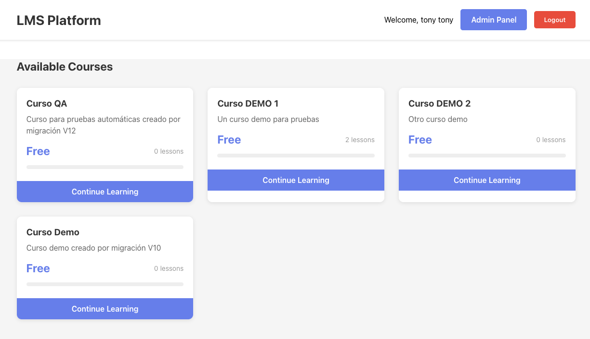
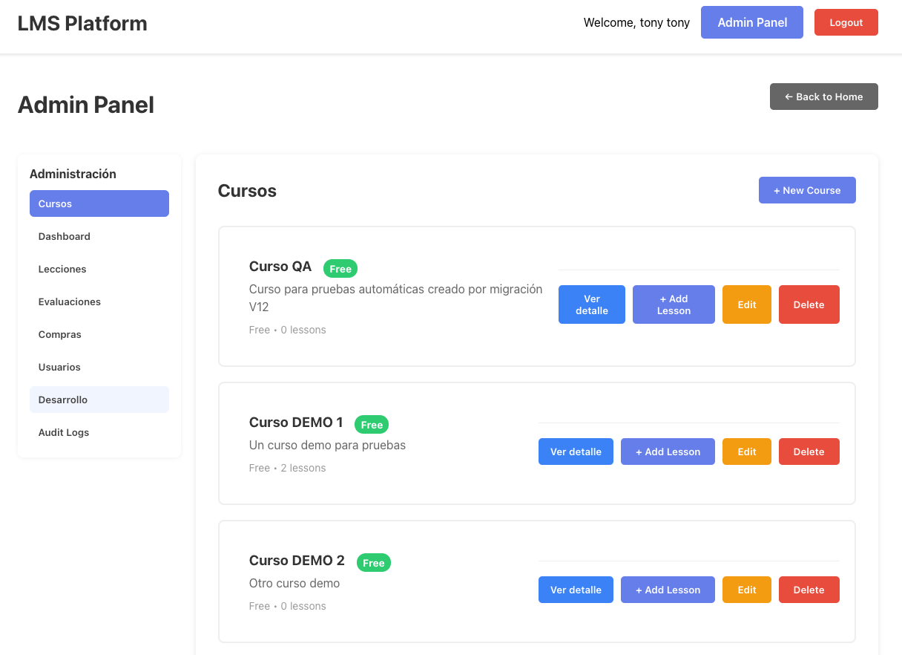
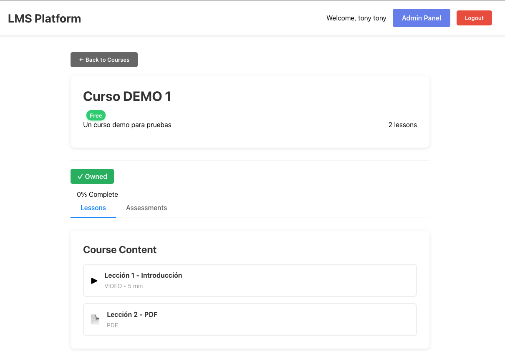

# LMS Platform - Learning Management System MVP



Sistema completo de gestión de aprendizaje (LMS) estilo Pluralsight para cursos online con compras integradas vía Stripe.





## 🏗️ Arquitectura

```
┌─────────────┐
│  React SPA  │ (Puerto 3000)
└──────┬──────┘
       │
       v
┌─────────────┐
│ Spring Boot │ (Puerto 8080)
│     API     │
└──────┬──────┘
       │
       ├──────> PostgreSQL (Puerto 5432)
       │
       ├──────> MinIO (Puerto 9000)
       │
       └──────> Stripe API
```

## ✨ Funcionalidades

### Usuarios
- ✅ Registro y login con JWT
- ✅ Roles: USER y ADMIN
- ✅ Sesión persistente

### Cursos
- ✅ Listado de cursos disponibles
- ✅ Detalle de curso con lecciones
- ✅ Compra mediante Stripe Checkout
- ✅ Acceso solo a cursos comprados

### Lecciones
- ✅ Soporte para videos (MP4)
- ✅ Soporte para PDFs
- ✅ URLs firmadas con MinIO (expiración 60 min)
- ✅ Reproductor HTML5 nativo
- ✅ Visualizador de PDFs

### Progreso
- ✅ Marcar lecciones como completadas
- ✅ Cálculo de % de progreso por curso
- ✅ Indicadores visuales de completitud

### Panel Admin
- ✅ Crear/editar/eliminar cursos
- ✅ Subir lecciones (video/PDF)
- ✅ Gestión completa de contenido

## 🚀 Instalación y Ejecución

### Prerequisitos
- Docker y Docker Compose
- Cuenta de Stripe (modo test)

### 1. Clonar el repositorio
```bash
git clone <repo-url>
cd lms-mvp
```

### 2. Configurar variables de entorno

#### Backend
Editar `docker-compose.yml` y actualizar:
```yaml
STRIPE_SECRET_KEY: sk_test_tu_clave_secreta
STRIPE_WEBHOOK_SECRET: whsec_tu_webhook_secret
```

#### Frontend
Crear archivo `.env` en `/frontend`:
```bash
REACT_APP_API_URL=http://localhost:8080/api
REACT_APP_STRIPE_PUBLIC_KEY=pk_test_tu_clave_publica
```

### 3. Levantar todo el sistema
```bash
docker compose up --build
```

Puedes usar este otro comando cuando quieras reiniciar todo y limpiar volúmenes (inicio totalmente limpio):

```bash
docker-compose down -v && docker-compose up --build -d
```

Esto levantará:
- **PostgreSQL** en `localhost:5432`
- **MinIO** en `localhost:9000` (consola en `localhost:9001`)
- **Backend API** en `localhost:8080`
- **Frontend** en `localhost:3000`
- **minio-init** *(servicio de inicialización, se ejecuta una vez y termina)*

> **📁 Archivos de media demo**
> El servicio `minio-init` sube automáticamente los archivos de prueba al bucket de MinIO en cada arranque. Los archivos deben existir en:
> ```
> media-resources/
> ├── sample-mp4-files-sample_960x540.mp4   ← video de ejemplo
> └── sample-pdf-file.pdf                   ← PDF de ejemplo
> ```
> No necesitas hacer nada manualmente. Las migraciones de Flyway (V14, V15) ya apuntan las lecciones demo a `demo/sample.mp4` y `demo/sample.pdf` en MinIO.

### 4. Acceder a la aplicacin

Abrir navegador en: **http://localhost:3000**

**Credenciales seeded (migraciones)**:

- Admin (V2):
  - Email: `admin@lms.com`
  - Password: `admin123` (hash incluido en la migraci?n V2)
  - Role: ADMIN

- Test user (V3):
  - Email: `test@example.com`
  - Password: `Password123` (hash incluido en la migraci?n V3)
  - Role: USER

- Dev user (V10):
  - Email: `dev@lms.local`
  - Role: ADMIN
  - Nota: la migraci?n crea este usuario pero NO establece un hash de contraseña (`<no-password-hash>`). Si quieres iniciar sesi?n con `dev@lms.local`, asigna una contraseña manualmente (ejemplo usando el mismo hash de `admin123`):

```bash
# Reemplaza el hash por el que prefieras; este es el hash usado en V2 para 'admin123'
docker-compose exec -T postgres psql -U lmsuser -d lmsdb -c "UPDATE users SET password = '$2a$10$N9qo8uLOickgx2ZMRZoMyeIjZAgcfl7p92ldGxad68LJZdL17lhWy' WHERE email = 'dev@lms.local';"
```

- Demo users (V11):
  - `alice@lms.local` (STUDENT) — no password set in seed (`<no-password-hash>`)
  - `bob@lms.local` (STUDENT) — no password set in seed
  - `instructor@lms.local` (INSTRUCTOR) — no password set in seed

- QA user (V12):
  - `qa@lms.local` (STUDENT) — no password set in seed

> Nota: Para usuarios que no tengan contrase?a en las migraciones puedes:
> - asignar un hash de BCrypt manualmente en la BD (ejemplo arriba), o
> - eliminar el usuario y registrarlo de nuevo via API (`/api/auth/register`) para crear una cuenta con contrase?a conocida.

> Si necesitas convertir un usuario a ADMIN puedes ejecutar (ejemplo):

```bash
# Promover un usuario a ADMIN (usar con precauci?n)
docker-compose exec -T postgres psql -U lmsuser -d lmsdb -c "UPDATE users SET role='ADMIN' WHERE email='test@example.com';"
```

> Si por alg?n motivo la migraci?n no crea `test@example.com`, puedes registrarlo manualmente con:

```bash
curl -s -X POST http://localhost:8080/api/auth/register \
  -H 'Content-Type: application/json' \
  -d '{"fullName":"Test User","email":"test@example.com","password":"Password123"}' | jq
```

## 📁 Estructura del Proyecto

```
lms-mvp/
├── backend/
│   ├── src/main/java/com/lms/
│   │   ├── auth/          # Autenticación y JWT
│   │   ├── users/         # Usuarios
│   │   ├── courses/       # Cursos
│   │   ├── lessons/       # Lecciones
│   │   ├── payments/      # Stripe + Compras
│   │   ├── progress/      # Progreso de usuario
│   │   ├── storage/       # MinIO client
│   │   └── config/        # Configuración Spring
│   ├── src/main/resources/
│   │   └── db/migration/  # Migraciones Flyway
│   ├── pom.xml
│   └── Dockerfile
│
├── frontend/
│   ├── src/
│   │   ├── api/           # Cliente Axios
│   │   ├── context/       # AuthContext
│   │   ├── pages/         # Componentes principales
│   │   │   ├── Login.js
│   │   │   ├── Register.js
│   │   │   ├── Home.js
│   │   │   ├── CourseDetail.js
│   │   │   ├── Lesson.js
│   │   │   └── Admin.js
│   │   └── App.js
│   ├── package.json
│   └── Dockerfile
│
└── docker-compose.yml
```

## 🔄 Flujo de Compra

1. Usuario navega a un curso
2. Click en "Purchase Course"
3. Redirección a Stripe Checkout
4. Usuario completa pago
5. Stripe envía webhook a `/api/payments/webhook`
6. Backend registra compra en BD
7. Usuario obtiene acceso al contenido

## 🔑 Configuración de Stripe Webhooks

### Desarrollo Local (usar Stripe CLI)
```bash
stripe listen --forward-to localhost:8080/api/payments/webhook
```

Esto te dará un `webhook secret` que debes poner en `STRIPE_WEBHOOK_SECRET`.

### Producción
Configurar webhook en Stripe Dashboard apuntando a:
```
https://tu-dominio.com/api/payments/webhook
```

Evento a escuchar: `checkout.session.completed`

## 📊 Base de Datos

### Migraciones
Se ejecutan automáticamente con Flyway al iniciar el backend.

### Schema
- **users**: Usuarios con roles
- **courses**: Cursos con precio
- **lessons**: Lecciones (VIDEO/PDF)
- **purchases**: Registro de compras
- **progress**: Progreso de lecciones

## 🎯 Endpoints API Principales

### Autenticación
```
POST /api/auth/register
POST /api/auth/login
```

### Cursos (públicos)
```
GET  /api/courses
GET  /api/courses/{id}
```

### Lecciones (autenticado)
```
GET  /api/lessons/{id}  # Retorna URL firmada
```

### Pagos (autenticado)
```
POST /api/payments/checkout/{courseId}
POST /api/payments/webhook  # Stripe webhook
```

### Admin (solo ADMIN)
```
POST   /api/admin/courses
PUT    /api/admin/courses/{id}
DELETE /api/admin/courses/{id}
POST   /api/admin/courses/{courseId}/lessons
DELETE /api/admin/lessons/{id}
```

### Progreso (autenticado)
```
POST /api/progress/lessons/{lessonId}/complete
```

## 🔒 Seguridad

- JWT con expiración de 24h
- Contraseñas hasheadas con BCrypt
- CORS configurado para frontend
- URLs de MinIO firmadas con expiración
- Validación de propiedad de curso antes de acceso

## 📦 Almacenamiento (MinIO)

### Acceder a consola de MinIO
```
URL: http://localhost:9001
Usuario: minioadmin
Password: minioadmin123
```

### Estructura de buckets
```
lms-content/
├── videos/
│   └── {uuid}_{filename}.mp4
└── pdfs/
    └── {uuid}_{filename}.pdf
```

## 🛠️ Decisiones Técnicas

### Backend
- **Monolito**: Más simple de desplegar y mantener
- **JWT propio**: Evita dependencia de Keycloak
- **Flyway**: Migraciones versionadas automáticas
- **MinIO**: S3-compatible, self-hosted
- **Stripe Checkout**: Simplifica flujo de pago

### Frontend
- **React hooks**: Código funcional y moderno
- **Context API**: Estado global sin Redux
- **Axios interceptors**: Manejo automático de auth
- **HTML5 video**: Reproductor nativo, sin deps

### Infraestructura
- **Docker Compose**: Orquestación simple
- **Todo local**: No depende de cloud
- **Nginx reverse proxy**: Servir frontend + proxy API

## 🚨 Limitaciones Conocidas (MVP)

- Sin paginación de cursos
- Sin búsqueda/filtros
- Sin sistema de comentarios
- Sin certificados
- Sin notificaciones email
- Sin analytics
- Sin transcoding de videos
- Sin CDN

## 🔧 Desarrollo

### Ejecutar backend solo
```bash
cd backend
mvn spring-boot:run
```

### Ejecutar frontend solo
```bash
cd frontend
npm install
npm start
```

### Hot reload / Desarrollo rápido (recomendado)
A continuación hay opciones para ver cambios inmediatamente (hot-reload) según tu flujo de trabajo.

1) Desarrollo local (recomendado)
- Ejecuta los servicios de infraestructura y backend con Docker (Postgres, MinIO y Backend) y corre el frontend en tu máquina con hot-reload:

```bash
# Desde la raíz del proyecto levanta infra + backend
docker compose up -d postgres minio backend

# En otra terminal, ejecuta el frontend en modo desarrollo (hot-reload)
cd frontend
npm install
npm start
```

- Abre: http://localhost:3000
- Ventaja: hot-reload de React; los cambios en `frontend/src/` se reflejan al instante.

2) Desarrollo dentro de Docker (frontend con hot-reload)
- Si prefieres ejecutar todo dentro de contenedores, crea un archivo `docker-compose.dev.yml` (junto al `docker-compose.yml`) con un override para el servicio `frontend` que monte tu código y ejecute `npm start`:

```yaml
# docker-compose.dev.yml (ejemplo)
version: '3.8'
services:
  frontend:
    image: node:18-alpine
    working_dir: /app
    volumes:
      - ./frontend:/app
      - /app/node_modules
    ports:
      - "3000:3000"
    command: ["/bin/sh","-c","npm install --no-audit --no-fund && npm start"]
    environment:
      - REACT_APP_API_URL=http://host.docker.internal:8080/api
```

- Levanta con:
```bash
docker compose -f docker-compose.yml -f docker-compose.dev.yml up --build
```
- Nota: en macOS `host.docker.internal` permite que el contenedor frontend acceda al backend que corre en el host o en otro contenedor; ajusta la URL de `REACT_APP_API_URL` según tu red.

3) Desarrollo rápido para solo reconstruir el build estático (cuando usas nginx)
- Si estás usando la configuración por defecto que construye el frontend y lo sirve con nginx (producción / staging local), necesitas reconstruir la imagen cuando cambias archivos del frontend:

```bash
# Reconstruir y levantar todo (útil tras cambios en frontend o backend)
docker compose up -d --build
```

- Si solo quieres reconstruir el frontend:
```bash
docker compose build frontend
docker compose up -d frontend
```

### Ver logs
```bash
docker compose logs -f backend
docker compose logs -f frontend
```

### Detener todo
```bash
docker compose down
```

### Limpiar volúmenes
```bash
docker compose down -v
```

## 📝 Próximos Pasos (Post-MVP)

1. Paginación y búsqueda de cursos
2. Sistema de ratings y reviews
3. Notificaciones por email
4. Soporte para quizzes
5. Certificados de completitud
6. Dashboard de analytics
7. Transcoding automático de videos
8. Subtítulos para videos

## 🤝 Contribuir

Este es un MVP educativo. Pull requests son bienvenidos.

## 📄 Licencia

MIT License - Usar libremente

---

**Creado por**: Ingeniero de Software Senior  
**Stack**: Java 17 + Spring Boot 3 + React 18 + PostgreSQL 15 + MinIO + Stripe

## Capturas headless (Playwright)

He incluido un pequeño script para tomar capturas headless de lecciones utilizando Playwright (Chromium). Esto es útil para pruebas visuales o para generar previews sin abrir un navegador manualmente.

1) Instalar dependencias (desde la raíz del proyecto):

```bash
cd /Users/usuario/Downloads/lms-mvp
npm init -y
npm i -D playwright
npx playwright install chromium
```

2) Ejecutar el script (ejemplo para la lección 22):

```bash
node scripts/playwright-screenshot.js 22 lesson-22
```

- El script guardará archivos: `lesson-22-full.png` (captura de la página completa) y `lesson-22-player.png` (recorte del reproductor si es posible).
- Asegúrate de que `docker compose up` esté corriendo antes de ejecutar el script.

## ⚖️ Licencia y Uso Comercial

Este proyecto está bajo la licencia **Business Source License 1.1 (BSL)**.

- **Para particulares, ONGs y Pequeñas Empresas:** El uso es totalmente gratuito (incluyendo uso comercial si facturas menos de $1M USD/año).
- **Para Grandes Empresas:** Si tu organización supera los límites de la BSL, necesitas una licencia comercial para usar este software en producción.
- **Compromiso Open Source:** En la "Change Date" (1 de enero de 2029), este código pasará automáticamente a ser **Apache 2.0**.
