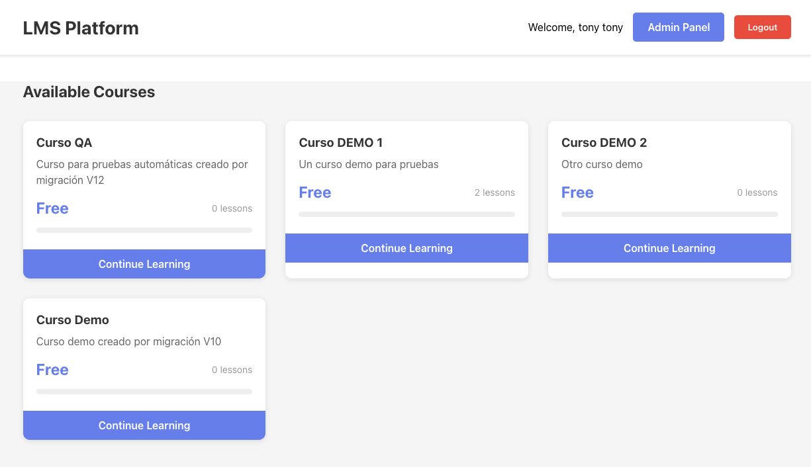
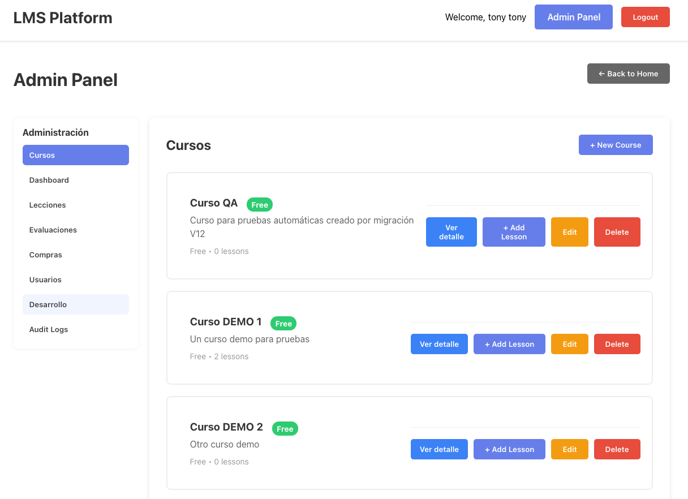
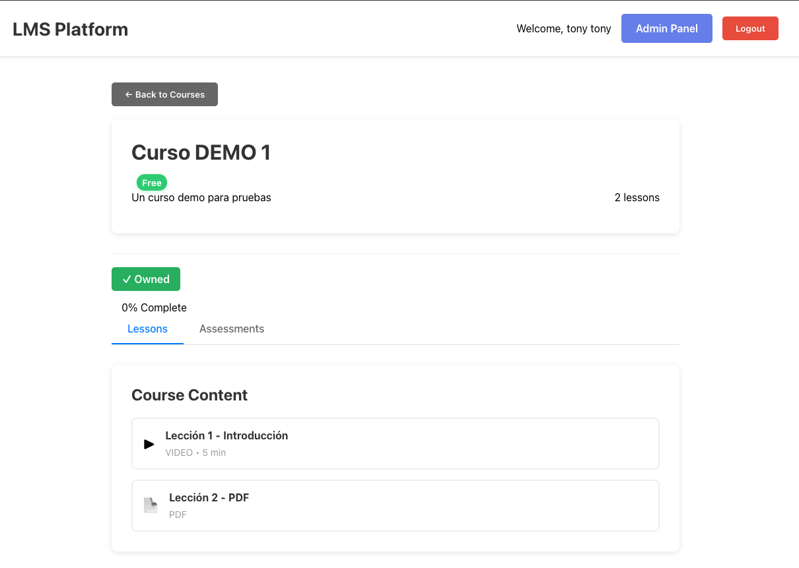

# LMS Platform - Learning Management System



Plataforma completa de gestión de aprendizaje estilo Pluralsight/Udemy con AI Tutor, gamificación, pagos Stripe, dark mode y panel administrativo con monitoreo en tiempo real.





## Arquitectura

```
┌──────────────────┐
│   React 18 SPA   │ (Puerto 3000)
│  + PWA + Dark Mode│
└────────┬─────────┘
         │
         v
┌──────────────────┐
│  Spring Boot 3.2  │ (Puerto 8080)
│   REST API + JWT  │
│  + Actuator       │
└────────┬─────────┘
         │
         ├──────> PostgreSQL 15 (Puerto 5432)
         ├──────> MinIO S3 (Puerto 9000)
         ├──────> Stripe API (pagos)
         └──────> Claude API (AI Tutor + Grading)
```

## Funcionalidades

### Core
- Registro/login con JWT (access token 15min + refresh token 7 días)
- Roles: STUDENT, INSTRUCTOR, ADMIN
- Password reset via email con token temporal
- Rate limiting en login/register (5/3 req por minuto por IP)
- CORS configurable por entorno

### Cursos y Lecciones
- Catálogo con filtros (categoría, tag, tipo de inscripción)
- Tipos de inscripción: OPEN, INVITE_ONLY, PAID
- Capacidad límite por curso
- Prerrequisitos entre cursos
- Módulos para organizar lecciones
- Soporte VIDEO (MP4 + Plyr player), PDF, AUDIO
- Drip content (lecciones que se liberan por fecha o días)
- Progreso por lección con % de completitud
- Video resume: continúa donde lo dejaste (guarda posición cada 15s)
- Navegación anterior/siguiente entre lecciones

### AI (Claude Sonnet)
- **AI Tutor**: chat flotante en cada curso, conoce el contenido del curso, modo socrático
- **AI Grading**: calificación automática de preguntas abiertas
- **Resúmenes AI**: genera bullet points y conceptos clave por lección (cacheados en DB)

### Gamificación
- XP por: lección completada (+25), evaluación (+50), curso completado (+200), reseña (+15), login diario (+5)
- Streaks con bonus a 7 y 30 días
- Badges automáticos (milestones XP, niveles, rachas)
- Leaderboard semanal y general
- Niveles 1-10 con barra de progreso

### Evaluaciones
- Quizzes con preguntas múltiple opción y abiertas
- Auto-grading para múltiple opción
- AI grading para preguntas abiertas (configurable)
- Submissions con estado: IN_PROGRESS, SUBMITTED, GRADED

### Pagos (Stripe)
- Stripe Checkout con webhook
- Bypass de pago en modo desarrollo (dev_payments)
- Cupones de descuento (código, %, máx usos, expiración)
- Historial de compras en admin

### Social
- Reseñas y ratings (1-5 estrellas) por curso
- Promedio de rating visible en catálogo
- Solo usuarios inscritos pueden reseñar

### Notificaciones
- Notificaciones in-app (campana con badge)
- Tipos: inscripción, badge ganado, curso completado
- Marcar como leída individual o todas
- Polling cada 60 segundos

### Waitlist y Grupos
- Lista de espera cuando un curso alcanza capacidad máxima
- Grupos de usuarios (bootcamps, empresas)
- Inscripción masiva por grupo
- Admin CRUD de grupos y miembros

### Panel Administrativo
- Dashboard de métricas (KPIs, gráficas de ingresos, inscripciones, heatmap de actividad)
- Business metrics (funnel de conversión, churn, ARPU, feature adoption)
- Monitoreo del sistema (JVM, DB, servicios, uptime)
- Rendimiento por endpoint (avg/max response time, semáforo)
- Seguridad (login attempts, rate limits, IPs sospechosas)
- Sesiones activas en tiempo real (usuarios online, dispositivos)
- Error tracking y log viewer
- Alertas configurables (error rate, response time, heap, logins fallidos)
- Feature toggles (habilitar/deshabilitar funcionalidades en runtime)
- Gestión de cursos, lecciones, módulos, categorías, tags
- Gestión de usuarios, estudiantes, instructores, roles
- Audit logs de acciones administrativas
- Cupones CRUD

### Frontend
- Dark mode con toggle (respeta prefers-color-scheme)
- Responsive design (móvil, tablet, desktop)
- Header con: búsqueda global, notificaciones, XP badge, user menu dropdown, hamburger menu
- Dashboard del estudiante (cursos en progreso, sugerencias, stats)
- Code splitting (React.lazy para Admin, Profile, Dashboard)
- Error boundaries
- Design system con CSS custom properties (variables.css)
- Componentes reutilizables (Button, Modal, FormField, Badge, Pagination, EmptyState, LoadingSkeleton)

## Instalación

### Prerequisitos
- Docker y Docker Compose
- Cuenta de Stripe (modo test)

### 1. Clonar y levantar
```bash
git clone <repo-url>
cd lms-mvp
docker compose up --build
```

### 2. Acceder
- **Frontend**: http://localhost:3000
- **Backend API**: http://localhost:8080
- **MinIO Console**: http://localhost:9001
- **Actuator Health**: http://localhost:8080/actuator/health

### 3. Credenciales de prueba

| Email | Password | Rol | Descripción |
|-------|----------|-----|-------------|
| `admin@lms.com` | `admin123` | ADMIN | Administrador principal |
| `test@example.com` | `Password123` | USER | Usuario de prueba |
| `carlos.mendez@demo.com` | `demo1234` | STUDENT | Estudiante activo (115 XP, 2 cursos) |
| `maria.garcia@demo.com` | `demo1234` | STUDENT | Estudiante (65 XP, 2 cursos) |
| `pedro.lopez@demo.com` | `demo1234` | STUDENT | Estudiante nuevo |
| `prof.rodriguez@demo.com` | `demo1234` | INSTRUCTOR | Instructor (React, Intro) |
| `prof.castillo@demo.com` | `demo1234` | INSTRUCTOR | Instructora (Python, Figma) |
| `prof.moreno@demo.com` | `demo1234` | INSTRUCTOR | Instructor (Arquitectura, DevOps, SQL) |

Cupones demo: `BIENVENIDO20` (20%), `DESCUENTO50` (50%), `GRATIS100` (100%)

### Reinicio limpio
```bash
docker-compose down -v && docker-compose up --build -d
```

## Variables de Entorno

### Backend
| Variable | Default | Descripción |
|----------|---------|-------------|
| `SPRING_DATASOURCE_URL` | — | URL JDBC de PostgreSQL |
| `JWT_SECRET` | dev secret | Secreto JWT (32+ chars) |
| `STRIPE_SECRET_KEY` | — | Clave secreta de Stripe |
| `STRIPE_WEBHOOK_SECRET` | — | Webhook secret de Stripe |
| `MINIO_ENDPOINT` | — | URL de MinIO |
| `CORS_ALLOWED_ORIGINS` | `http://localhost:3000` | Origins permitidos (comma-separated) |
| `MAIL_ENABLED` | `false` | Habilitar envío de emails |
| `MAIL_HOST` | `smtp.gmail.com` | Servidor SMTP |
| `MAIL_USERNAME` | — | Usuario SMTP |
| `MAIL_PASSWORD` | — | Password SMTP |
| `AI_TUTOR_ENABLED` | `false` | Habilitar AI Tutor |
| `AI_TUTOR_API_KEY` | — | API key de Anthropic |
| `AI_TUTOR_MODEL` | `claude-sonnet-4-20250514` | Modelo de Claude |
| `AI_GRADING_ENABLED` | `false` | Habilitar AI Grading |

### Frontend
| Variable | Default | Descripción |
|----------|---------|-------------|
| `REACT_APP_API_URL` | `http://localhost:8080/api` | URL del backend |
| `REACT_APP_STRIPE_PUBLIC_KEY` | — | Clave pública de Stripe |

## Estructura del Proyecto

```
lms-mvp/
├── backend/src/main/java/com/lms/
│   ├── auth/           # JWT, login, register, refresh, password reset
│   ├── users/          # Usuarios, grupos, roles
│   ├── courses/        # Cursos, admin, búsqueda, dashboard
│   ├── lessons/        # Lecciones, streaming
│   ├── payments/       # Stripe, compras, cupones
│   ├── progress/       # Progreso, video position
│   ├── assessments/    # Evaluaciones, AI grading
│   ├── enrollments/    # Waitlist
│   ├── reviews/        # Reseñas y ratings
│   ├── notifications/  # Notificaciones in-app
│   ├── gamification/   # XP, badges, streaks, leaderboard
│   ├── ai/             # AI Tutor, resúmenes, chat
│   ├── monitoring/     # Request metrics, security events, sessions, alerts
│   ├── email/          # Email service (SMTP)
��   ├── config/         # Security, feature toggles, audit, metrics
│   └── storage/        # MinIO integration
│
├── backend/src/main/resources/
│   └── db/migration_clean/   # 38 migraciones Flyway (V1-V38)
│
├── frontend/src/
│   ├── api/            # Axios client + refresh token interceptor
│   ├── context/        # AuthContext, ThemeContext, FeatureContext
│   ├── hooks/          # useApi, usePagination, useForm
│   ├── components/
│   │   ├── common/     # Button, Modal, FormField, Badge, Pagination, EmptyState, LoadingSkeleton, ErrorBoundary
│   │   ├── domain/     # AiTutor, NotificationBell, SearchBar, CourseReviews, GamificationWidget
│   │   └── Header.js   # UserMenu dropdown, hamburger, search, notifications, XP badge, dark mode toggle
│   ├── pages/
│   │   ├── admin/      # 12 sub-páginas (Courses, Users, Students, Monitoring, etc.)
│   │   ├── profile/    # 4 sub-componentes (Info, Courses, Certificates, Password)
│   │   ├── assessments/# CreateAssessment, TakeAssessment
│   │   ├── Dashboard.js, Home.js, CourseDetail.js, Lesson.js, Login.js, Register.js
│   │   ├── ForgotPassword.js, ResetPassword.js
│   │   └── Profile.js, Admin.js
│   └── styles/         # variables.css (design tokens + dark theme)
│
├── e2e/                # Playwright E2E tests + BDD infrastructure
├── features/           # Gherkin feature files (BDD)
├── docs/               # SDD, CDD, Plan de Acción
├── docker-compose.yml
├── docker-compose.prod.yml
└── .env.prod.example
```

## API Endpoints (resumen)

### Públicos
```
POST   /api/auth/register, /login, /refresh, /forgot-password, /reset-password
GET    /api/courses, /api/courses/{id}
GET    /api/courses/categories, /api/courses/tags
GET    /api/search?q={term}
GET    /api/features
GET    /api/courses/{id}/reviews, /api/courses/{id}/rating
GET    /api/gamification/leaderboard
GET    /actuator/health
```

### Autenticados
```
GET    /api/users/me
PUT    /api/users/me, /api/users/me/password
GET    /api/dashboard
GET    /api/notifications, /api/notifications/unread-count
PUT    /api/notifications/{id}/read, /api/notifications/read-all
GET    /api/gamification/stats, /api/gamification/xp/recent
POST   /api/gamification/daily-login
GET    /api/tutor/courses/{id}/conversation
POST   /api/tutor/conversations/{id}/message
POST   /api/courses/{id}/reviews
POST   /api/courses/{id}/waitlist
POST   /api/payments/checkout/{courseId}
POST   /api/coupons/validate
POST   /api/progress/lessons/{id}/complete
PUT    /api/progress/lessons/{id}/position
GET    /api/lessons/{id}/summary
```

### Admin
```
/api/admin/courses, /lessons, /users, /students, /instructors
/api/admin/purchases, /audit, /dev, /groups
/api/admin/categories, /tags, /modules
/api/admin/management/users/{id}/role, /active
/api/admin/management/certificates/{userId}/{courseId}
/api/admin/monitoring/dashboard, /health, /jvm, /performance, /security, /sessions, /errors
/api/admin/alerts/rules, /history, /check
/api/admin/metrics/summary, /sales-timeseries, /enrollments-timeseries, /top-courses, /business
/api/admin/coupons, /reviews/{id}
```

## Tests

### E2E (Playwright)
```bash
cd e2e
npm ci
npx playwright install chromium
npm test
```

### Backend BDD (Cucumber + TestContainers)
```bash
cd backend
mvn test
# Reporte HTML: target/cucumber-report.html
```

### Frontend (Jest + React Testing Library)
```bash
cd frontend
npm test -- --ci --watchAll=false
```

### CI/CD
GitHub Actions ejecuta 3 jobs en paralelo:
1. `backend-tests` — Maven + TestContainers (~3 min)
2. `frontend-tests` — Jest (~2 min)
3. `e2e` — Docker Compose + Playwright (~8 min)

## Producción

```bash
# Copiar y configurar variables
cp .env.prod.example .env.prod

# Levantar con overrides de producción
docker compose -f docker-compose.yml -f docker-compose.prod.yml --env-file .env.prod up -d
```

Incluye: health checks, restart policies, memory limits, sin hot reload.

## Stack Técnico

| Capa | Tecnología |
|------|-----------|
| Backend | Java 17, Spring Boot 3.2.1, Spring Security, JPA/Hibernate |
| Frontend | React 18, React Router 6, Axios, Chart.js, Plyr |
| Base de datos | PostgreSQL 15, Flyway (38 migraciones) |
| Storage | MinIO (S3-compatible) |
| Pagos | Stripe Checkout + Webhooks |
| AI | Claude Sonnet (Anthropic API) |
| Auth | JWT (access + refresh tokens), BCrypt |
| Tests | Cucumber 7.15, TestContainers, Jest, React Testing Library, Playwright |
| CI/CD | GitHub Actions |
| Infraestructura | Docker Compose |

## Licencia

**Business Source License 1.1 (BSL)**
- Gratis para organizaciones con menos de $1M USD/año de facturación
- Licencia comercial requerida para grandes empresas
- Pasa automáticamente a **Apache 2.0** el 1 de enero de 2029
